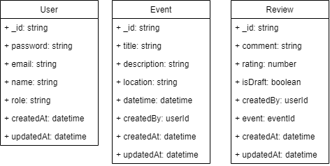

# Pop Quiz

## Description

Pop Quiz - An MVP for an event management review and rating app.

You can see a live demo here https://pop-quiz.juannavas.dev/

**Note:** Each side `/frontend` and `/backend` have their own README. [Frontend - README](./frontend/README.md) [Backend - README](./backend/README.md)

## Features

- View news in the home page.
- Login, register, password recovery.
- As admin, create event with title, description, location, and date time.
- Add review with rating and comment to event.
- As admin, view all events reviews.
- As admin, delete event.

## Architecture

## Use case

## DB Schema

